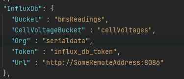

## Deye battery serial bus reader

### Data
  - CAN data frames
    - Full array information
  - RS485 individual cell voltages 
    - **Will move to seperate project soon**

### Software prerequisites 
  - InfluxDB on some remote server
    - Setup orginisation and bucket and replace values in `appsetting.json`
    
    
  

### Dashboard API's
    https://xxx.xxx.xxx.xxx:5035/candata
    https://xxx.xxx.xxx.xxx:5035/rs485

### Grafana dashboard (file included) 

### Was built from findings with [CAN Monitor 3000](https://github.com/tixiv/CAN-Monitor-qt)

Includes CAN BUS tree (XML) of known frame types

#### CAN Monitor 3000 Windows application

#### Based on this device:

#### Hardware connection side 

## TODO
 - Add support for InterCAN-BUS messages
   - Cell voltages 
   - 6x Temp sensors
   - Should require only **one** CAN device for all information
 - Add setup details for raspberry pi
 - CAN frames
   - Debugging for Frame analysis
 - Split RS485 and CAN into seperate projects
 - 
 - Document reverse engineering process in more detail
  - RS485 serial payload

	

